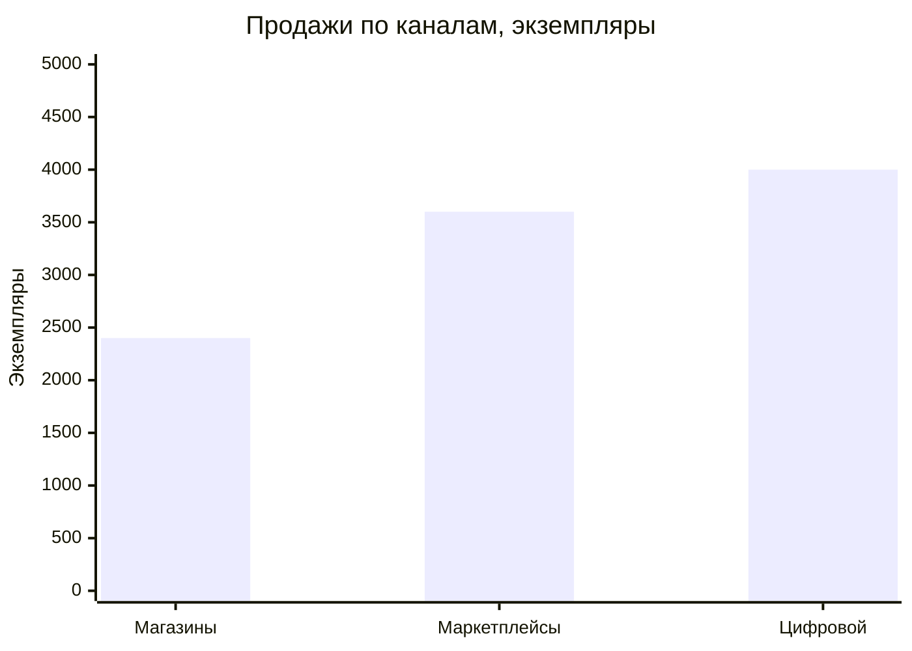
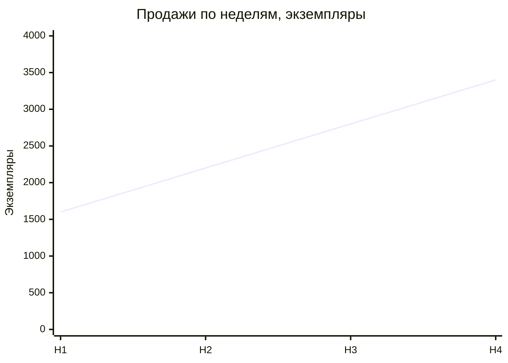
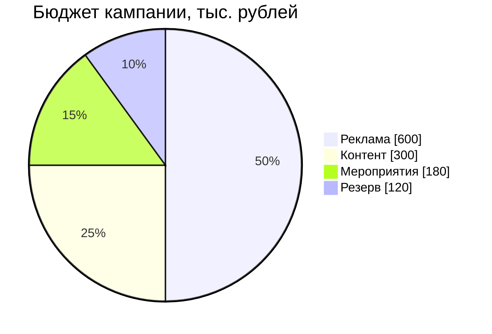
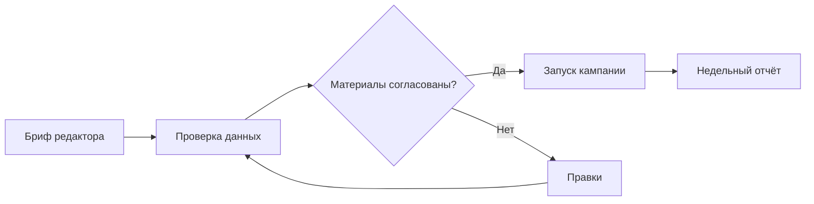
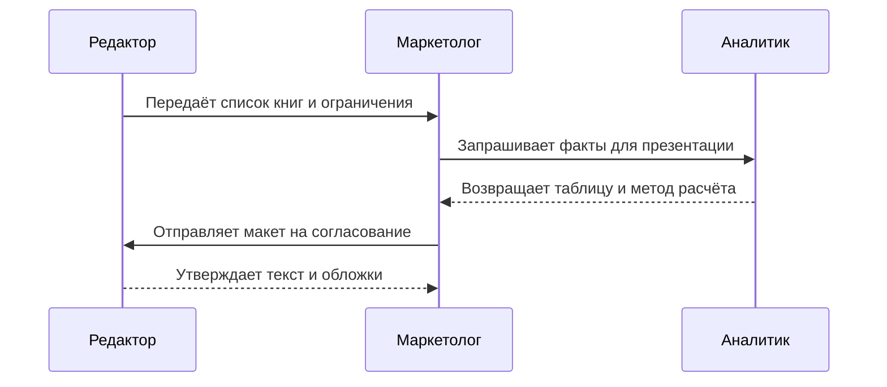
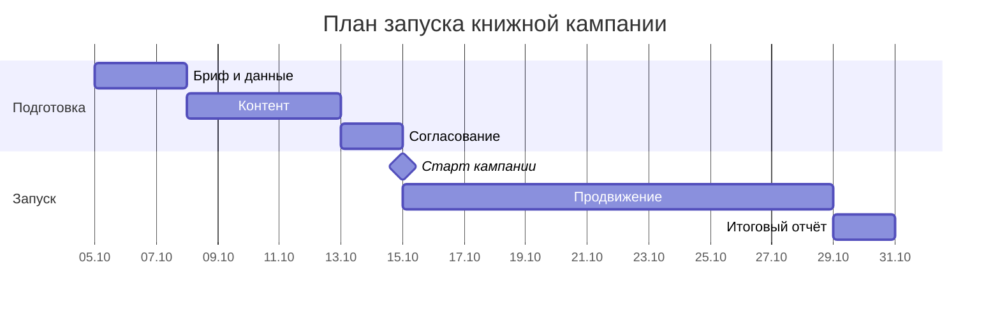

# Книжная кампания: результаты и план запуска

Решение для руководителя: согласовать бюджет 1,2 млн ₽ и календарь кампании.

Цель — поддержать продажи подборки книг в трёх каналах.

Все числа в примере — учебные данные, не отчёт компаний марафона.

---

# Что требуется согласовать

- Бюджет: 1 200 тыс. ₽.
- Старт продвижения: **15 октября 2026 года**.
- Продолжительность продвижения: **14 календарных дней**.
- Еженедельный контроль продаж, расходов и готовности материалов.

---

# Исходные данные: один период, одинаковые единицы

| Канал | Экземпляры | Выручка, тыс. ₽ |
|---|---:|---:|
| Магазины | 2 400 | 1 440 |
| Маркетплейсы | 3 600 | 1 980 |
| Цифровой | 4 000 | 1 200 |
| **Итого** | **10 000** | **4 620** |

Один четырёхнедельный период. Выручка не равна прибыли.

---

# Цифровой канал лидирует по количеству

4 000 экземпляров — 40% количества. Это не доля выручки.

Контроль: 2 400 + 3 600 + 4 000 = 10 000.

---

# Недельные продажи растут в учебном примере

Н1: 1 600 · Н2: 2 200 · Н3: 2 800 · Н4: 3 400.

Сумма — 10 000. Рост с Н1 до Н4 — 112,5%; причинный эффект рекламы не доказан.

---

# Половину бюджета направляем на рекламу

600 + 300 + 180 + 120 = 1 200 тыс. ₽.
Доли: 50% / 25% / 15% / 10%.

---

# У расходов есть назначение и ответственный

| Статья | Тыс. ₽ | Доля | Назначение |
|---|---:|---:|---|
| Реклама | 600 | 50% | Привлечь читателей |
| Контент | 300 | 25% | Подготовить материалы |
| Мероприятия | 180 | 15% | Представить подборку |
| Резерв | 120 | 10% | Покрыть согласованные изменения |

Резерв расходуется только после отдельного согласования.

---

# Материалы проходят проверку до запуска

Правки возвращаются на проверку данных; запуск разрешён после согласования.

---

# Редактор и маркетолог согласуют один макет

---

# Запуск зависит от готовности контента

Бриф: 5–8 октября. Контент: 8–13 октября. Согласование: 13–15 октября.
Интервалы указаны от начала до исключённой даты окончания; дни календарные.

---

# Календарь для сверки диаграммы Ганта

| Этап | Начало | Окончание, не включая | Дней |
|---|---|---|---:|
| Бриф | 05.10 | 08.10 | 3 |
| Контент | 08.10 | 13.10 | 5 |
| Согласование | 13.10 | 15.10 | 2 |
| Продвижение | 15.10 | 29.10 | 14 |
| Отчёт | 29.10 | 31.10 | 2 |

Задержка согласования сдвигает запуск, если план не пересмотрен.

---

# Риски обсуждаем вместе с решением

| Риск | Ранний сигнал | Действие |
|---|---|---|
| Материалы не готовы | Нет согласования к 15.10 | Пересмотреть дату запуска |
| Расходы выше плана | Превышен лимит статьи | Согласовать изменение |
| Падает отклик | Снижение отклика рассылки | Проверить предложение и аудиторию |

Не объясняем изменение продаж одной рекламой без сравнения и дополнительных данных.

---

# Решение и следующий шаг

Согласовать бюджет 1,2 млн ₽ и дату запуска 15 октября.

Маркетолог отвечает за календарь и расходы; редактор — за содержание; аналитик — за сверку показателей.

Через неделю после запуска: продажи по каналам, расходы по статьям, список отклонений.

---

# Контрольные значения для переноса

- 14 слайдов; последовательность сохранена.
- Продажи: **10 000 экземпляров**, выручка **4 620 тыс. ₽**.
- Бюджет: 1 200 тыс. ₽, сумма долей **100%**.
- Гант: запуск **15.10**, продвижение **14 дней**.
- Шесть диаграмм: столбцы, линия, круг, процесс, взаимодействие, Гант.
- Ни одна диаграмма не осталась блоком исходного кода.
