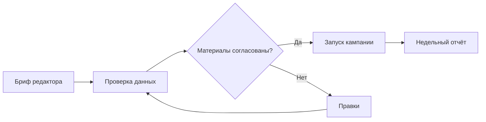
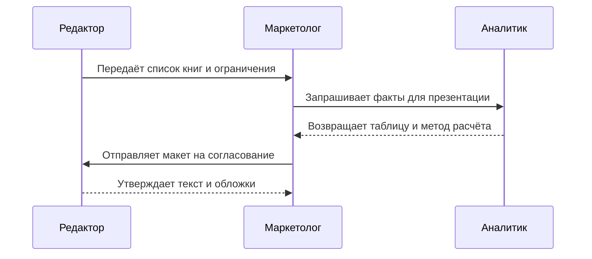
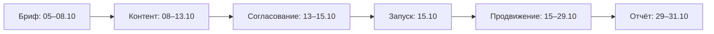

<!-- paginate: true -->

<!-- _class: cover -->

# Книжная кампания

Решение для руководителя: согласовать бюджет 1,2 млн ₽ и календарь кампании.

Цель — поддержать продажи подборки книг в трёх каналах.

Все числа в примере — учебные данные, не отчёт компаний марафона.

---

<!-- _class: content -->

## Параметры запуска

- Бюджет: 1 200 тыс. ₽.
- Старт продвижения: **15 октября 2026 года**.
- Продолжительность продвижения: **14 календарных дней**.
- Еженедельный контроль продаж, расходов и готовности материалов.

---

<!-- _class: content -->

## Продажи по каналам

| Канал | Экземпляры | Выручка, тыс. ₽ |
|---|---:|---:|
| Магазины | 2 400 | 1 440 |
| Маркетплейсы | 3 600 | 1 980 |
| Цифровой | 4 000 | 1 200 |
| **Итого** | **10 000** | **4 620** |

Один четырёхнедельный период. Выручка не равна прибыли.

---

<!-- _class: content columns -->

## Сравнение каналов продаж

<!-- marplio:column left -->

```chart
{"version":1,"type":"bar","title":"Продажи по каналам","labels":["Магазины","Маркетплейсы","Цифровой"],"series":[{"name":"Экземпляры","values":[2400,3600,4000]}]}
```

<!-- marplio:column right -->

4 000 экземпляров — 40% количества. Это не доля выручки.

Контроль: 2 400 + 3 600 + 4 000 = 10 000.

---

<!-- _class: content columns -->

## Продажи по неделям

<!-- marplio:column left -->

```chart
{"version":1,"type":"line","title":"Продажи по неделям","labels":["Н1","Н2","Н3","Н4"],"series":[{"name":"Экземпляры","values":[1600,2200,2800,3400]}]}
```

<!-- marplio:column right -->

Н1: 1 600 · Н2: 2 200 · Н3: 2 800 · Н4: 3 400.

Сумма — 10 000. Рост с Н1 до Н4 — 112,5%; причинный эффект рекламы не доказан.

---

<!-- _class: content columns -->

## Распределение бюджета

<!-- marplio:column left -->

```chart
{"version":1,"type":"pie","title":"Бюджет кампании","labels":["Реклама","Контент","Мероприятия","Резерв"],"series":[{"name":"Тыс. рублей","values":[600,300,180,120]}]}
```

<!-- marplio:column right -->

600 + 300 + 180 + 120 = 1 200 тыс. ₽.
Доли: 50% / 25% / 15% / 10%.

---

<!-- _class: content -->

## Назначение расходов

| Статья | Тыс. ₽ | Доля | Назначение |
|---|---:|---:|---|
| Реклама | 600 | 50% | Привлечь читателей |
| Контент | 300 | 25% | Подготовить материалы |
| Мероприятия | 180 | 15% | Представить подборку |
| Резерв | 120 | 10% | Покрыть согласованные изменения |

Резерв расходуется только после отдельного согласования.

---

<!-- _class: content -->

## Согласование материалов



---

<!-- _class: content -->

## Взаимодействие участников



---

<!-- _class: content -->

## Календарь кампании



---

<!-- _class: content -->

## Даты и длительность этапов

| Этап | Начало | Окончание, не включая | Дней |
|---|---|---|---:|
| Бриф | 05.10 | 08.10 | 3 |
| Контент | 08.10 | 13.10 | 5 |
| Согласование | 13.10 | 15.10 | 2 |
| Продвижение | 15.10 | 29.10 | 14 |
| Отчёт | 29.10 | 31.10 | 2 |

Задержка согласования сдвигает запуск, если план не пересмотрен.

---

<!-- _class: content -->

## Риски кампании

| Риск | Ранний сигнал | Действие |
|---|---|---|
| Материалы не готовы | Нет согласования к 15.10 | Пересмотреть дату запуска |
| Расходы выше плана | Превышен лимит статьи | Согласовать изменение |
| Падает отклик | Снижение отклика рассылки | Проверить предложение и аудиторию |

Не объясняем изменение продаж одной рекламой без сравнения и дополнительных данных.

---

<!-- _class: content -->

## Решение о запуске

Согласовать бюджет 1,2 млн ₽ и дату запуска 15 октября.

Маркетолог отвечает за календарь и расходы; редактор — за содержание; аналитик — за сверку показателей.

Через неделю после запуска: продажи по каналам, расходы по статьям, список отклонений.

---

<!-- _class: content -->

## Проверка результата

- 14 слайдов; последовательность сохранена.
- Продажи: **10 000 экземпляров**, выручка **4 620 тыс. ₽**.
- Бюджет: 1 200 тыс. ₽, сумма долей **100%**.
- Календарь: запуск **15.10**, продвижение **14 дней**.
- Шесть диаграмм: столбцы, линия, круг, процесс, взаимодействие, календарь.
- Ни одна диаграмма не осталась блоком исходного кода.
